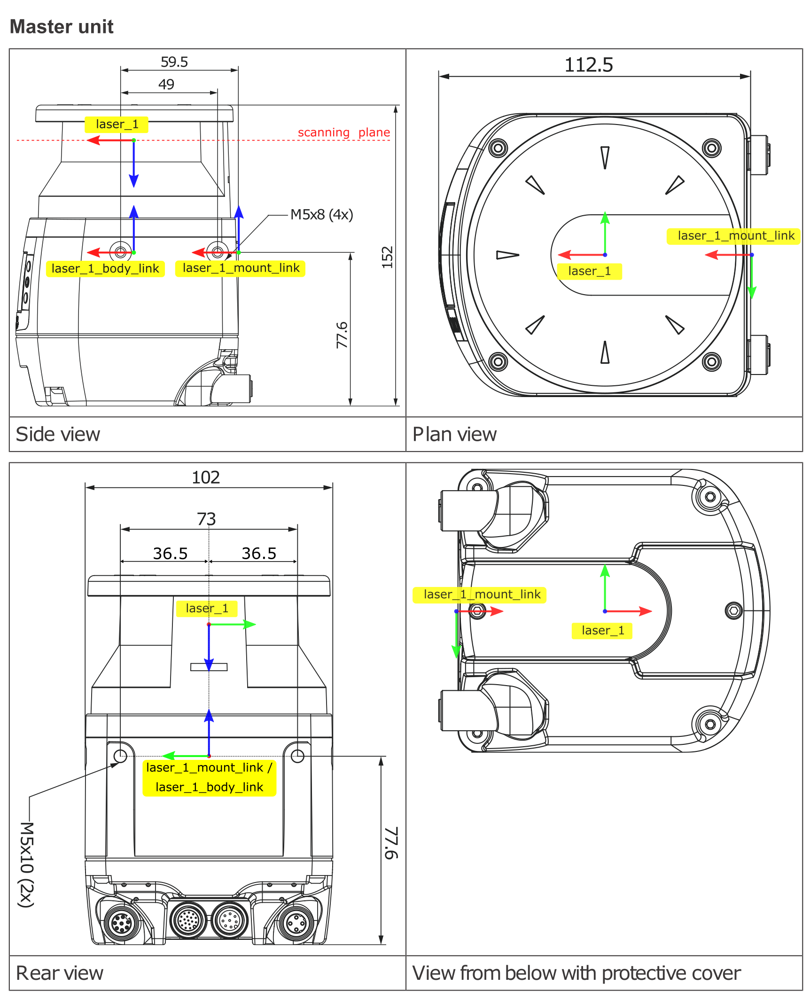
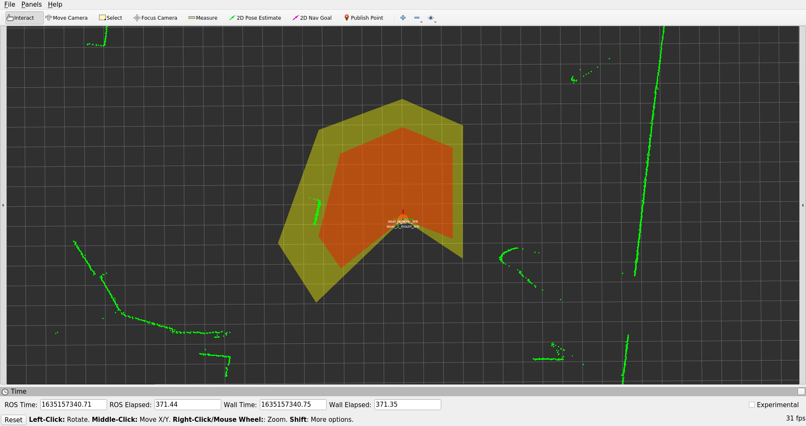

[](https://www.pilz.com)

# PILZ safety laser scanner PSENscan

## Package: psen_scan_v2

The **psen_scan_v2** package is a ROS integration driver for the PSENscan safety laser scanner product. It lets you integrate the laser scanner data into your ROS Environment easily. Using the standard [sensor_msgs/LaserScan][] message format ensures compatibility with other laserscan-post-processing nodes such as [gmapping][]. For a general overview, link collection and tutorials we refer to the [ROS wiki page](http://wiki.ros.org/psen_scan_v2).

<p align="center">

</p>

PSENscan firmware >= 3.1.0 is supported on the following models:

| Type | Features | Order number |
|------|----------|--------------|
| |	Common features:<ul><li>compliant and approved in accordance with: EN/IEC 61496-1: Type 3, EN ISO 13849-1: PL d, IEC 61508: SIL 2</li><li>opening angle: 275°</li><li>operating range: 3.0 or 5.5 m safety zone, 40 m warning zone</li><li>reaction time: 62 ms</li><li>Protection type: IP65</li><li>Dimensions (H x W x D) in mm: 152 x 102 x 112.5</li></ul> | |
| | *Light versions*	Additional features: Muting, EDM, Override | |
| PSEN sc L 3.0 08-12	| 3.0 m safety zone, 8 or 12-pin exchangeable memory module |	6D000012 |
| PSEN sc L 5.5 08-12	| 5.5 m safety zone, 8 or 12-pin exchangeable memory module	| 6D000013 |
| | *Master versions*	Additional features: Muting, EDM, Override, restart in accordance with EN ISO 61496-3, vertical applications| |
| PSEN sc M 3.0 08-12	| 3.0 m safety zone, 8 or 12-pin exchangeable memory module	| 6D000016 |
| PSEN sc M 5.5 08-12	| 5.5 m safety zone, 8 or 12-pin exchangeable memory module	| 6D000017 |
| PSEN sc ME 5.5 08-17  | Master Encoder, 5.5 m safety zone, 8/17-pin exchangeable memory | 6D000019 |

## C++ standalone library
If you are interested in using the PSENscan safety laser scanner without ROS, please take a look at our C++ standalone library. You can read more about it [in the `standalone` folder](https://github.com/PilzDE/psen_scan_v2/blob/main/standalone/README.md)

## Table of Contents

1. [Installation](#installation)
2. [Usage](#usage)
   + [Parameters](#parameters)
   + [Optional Parameters](#optional-parameters)
   + [Expert Parameters (optional)](#expert-parameters-optional)
   + [Published Topics](#published-topics)
   + [TF Frames](#tf-frames)
   + [Defining the scan range](#defining-the-scan-range)
   + [Timestamp details](#timestamp-details)
   + [Importing the zoneset configuration](#importing-the-zoneset-configuration)
   + [Visualizing the active zoneset](#visualizing-the-active-zoneset)
3. [Developer Information](#developer-information)
   + [Build Status](#build-status)
   + [Branching model](#branching-model)
   + [Test concept](#test-concept)
4. [Migration](#migration)

## Installation
Needed Equipment:
- PSENscan safety laser scanner
- ROS Machine

To use the package, you can install prebuilt packages with
```
sudo apt install ros-$ROS_DISTRO-psen-scan-v2
```

## Usage
To start reading data from the safety laser scanner and publishing scans execute `roslaunch psen_scan_v2 psen_scan_v2.launch` in a command line. This will launch the ROS Node with the default configuration.

If you wish to set parameters from the command line, add them to the end of the command as `parameter:=value`, separated by spaces.

```bash
roslaunch psen_scan_v2 psen_scan_v2.launch sensor_ip:=192.168.0.10
```
This example configures the safety laser scanner at 192.168.0.10 to send it´s frames to the ROS node at localhost.

In order to create an application with your own launch file, you can include the `bringup.launch`, where you can easily adjust the configuration parameters. A more detailed explanation can be found in the [tutorials](http://wiki.ros.org/psen_scan_v2/Tutorials/).

### Parameters

_sensor_ip_ (_string_, default: "192.168.0.10")<br/>
IP-Address of safety laser scanner.

### Optional Parameters

_tf_prefix_ (_string_, default: "laser_1")<br/>
Name of this scanner that can be changed to differentiate between multiple devices. By convention this is used as tf prefix.

_angle_start_ (_double_, default: -2.398 (= -137.4 deg))<br/>
Start angle of measurement. (Radian)

_angle_end_ (_double_, default: 2.398 (= 137.4 deg))<br/>
End angle of measurement. It is included in the measurements. (Radian)

_intensities_ (_bool_, default: false)<br/>
Publish intensities. If this is enabled, the resolution needs to be increased (at least 0.2 deg).

_resolution_ (_double_, default: 0.0017 (= 0.1 deg))<br/>
Scan angle resolution. (Radian) The value is rounded to a multiple of 0.1 deg and has to be in the range [0.1, 10] degrees.

_config_file_ (_string_, default: "")
Full path to a scanner config file. If a file is provided the configured zonesets and active zone marker are published, see [here](#importing-the-zoneset-configuration) for more information.

### Expert Parameters (optional)

_host_ip_ (_string_, default: "auto")<br/>
IP-Address of host machine. The IP of the local machine is used by default.

_host_udp_port_data_ (_int_, default: 55115)<br/>
UDP Port on which monitoring frames (scans) should be received.

_host_udp_port_control_ (_int_, default: 55116)<br/>
UDP Port used to send commands (start/stop) and receive the corresponding replies.

_fragmented_scans_ (_bool_, default: false)<br/>
Publish scan data as soon as a UDP packet is ready, do not wait for a full scan.

_rviz_ (_bool_, default: true)<br/>
Start a preconfigured rviz visualizing the scan data.

### Published Topics
/\<name\>/scan ([sensor_msgs/LaserScan][])<br/>

* If _fragmented_scans_ is set to false (default) the driver will publish complete scan rounds from the PSENscan safety laser scanner as a single message.
* If _fragmented_scans_ is enabled the driver will send the measurement data as soon as they arrive, instead of waiting for the scan round to be completed. This way the scan data is received sooner but is split into several sensor messages.
* `Hint 1: Scan rounds and fragments that contain no measurement data are not published. This can happen with smaller scan ranges.`
* `Hint 2: Frequency of the laser scan messages is about 33hz for the combined and 200hz for the fragmented scans.`

/\<name\>/zoneconfiguration ([psen_scan_v2/ZoneSetConfiguration](http://docs.ros.org/en/noetic/api/psen_scan_v2/html/msg/ZoneSetConfiguration.html))<br/>

* `Hint 1: Will not be advertised if no config_file is provided.`

/\<name\>/active_zoneset ([std_msgs/UInt8][])<br/>

* This topic contains the id of the currently active zoneset of the PSENscan safety laser scanner.

* `Hint 1: If no zonesets are configured the driver will publish "0" as default.`

/\<name\>/active_zoneset_marker ([visualization_msgs/Marker][]) <br/>

* The markers published represent the currently active zoneset as triangle lists. They can be viewed e.g. in rviz.

* `Hint 1: Uses the topics /<name>/zoneconfiguration and /<name>/active_zoneset to calculate the vizualization and updates in the same frequency as those topics.`

* `Hint 2: Will not be advertised if no config_file is provided.`

### TF Frames
The location of the TF frames is shown in the image below.
These names are defined by the aforementioned launchfile parameter `name`.
Changing them is necessary for instance when running multiple scanners.
<p align="center">

</p>

### Defining the scan range
You can adjust the scan field to your needs by changing _angle_start_ and _angle_end_.
The published ([sensor_msgs/LaserScan][]) will only contain data within the given angle limits.
Both limits are defined within the _laser_1_ frame as shown in the image below.

<p align="center">

</p>

### Timestamp details
The timestamps of the scan data published are computed to be close to reality and processing speed of incoming data was optimized to reduce the time for the scan data to be published. This should suffice for localization and slam algorithms. If you application benefits from getting the scan data any sooner there are two possibilities:

* Use fragmented scans. This will publish the individual frames received by the PsenScan hardware immediately instead of waiting for a scan round to be completed and combined to a single laser scan message.
* Use the tcp_nodelay flag in your ROS subscriber. This will disable the nagle's algorithm, which is a TCP optimization. This algorithm can produce a jitter of about 20ms in the ros topic.
   * The cpp API of ROS does not support disabling this on the publisher side. If you don't have control over the subscriber e.g. due to using a third party package you can create a python node which acts as a repeater for the scan topic. rospy subscriber and publisher both allow setting this flag and thus can disable it for this driver and the third party package.


### Importing the zoneset configuration
Once you setup the scanner and created a configuration according to our [tutorial](http://wiki.ros.org/psen_scan_v2/Tutorials/SettingUpPSENscanHW#Create_a_new_configuration) you can use an exported xml configuration file within ROS.
The configured zonesets will be published.

The zonesets you created in the Pilz configurator:


will be exactly the same in ROS:


You can try this out with:
```
roslaunch psen_scan_v2 psen_scan_v2.lauch config_file:='full_path_to/example_config.xml'
```

If you want to use the configuration node in your launchfile add a section such as:

```
<node ns="$(arg laser_ns)" name="config_server_node_$(arg laser_ns)" type="config_server_node" pkg="psen_scan_v2">
  <param name="config_file" value="$(arg config_file)" />
  <param name="frame_id" value="$(arg frame_id)" />
</node>
```

### Visualizing the active zoneset
For visualizing the active zoneset in RViz you can run the `active_zoneset_node`. It will publish markers on the `/<name>/active_zoneset_marker` topic like shown in the RViz screenshot above.

## Developer Information
### Build Status
| Platform | Melodic | Noetic |
| -------- | ------- | ------ |
| CI | [](https://github.com/PilzDE/psen_scan_v2/actions?query=event%3Apush+workflow%3ACI-Melodic+branch%3Amain) | [](https://github.com/PilzDE/psen_scan_v2/actions?query=event%3Apush+workflow%3ACI-Noetic+branch%3Amain) |
| Buildfarm src | [](http://build.ros.org/job/Msrc_uB__psen_scan_v2__ubuntu_bionic__source/) | [](http://build.ros.org/job/Nsrc_uF__psen_scan_v2__ubuntu_focal__source/) |
| Buildfarm bin | [](http://build.ros.org/job/Mbin_uB64__psen_scan_v2__ubuntu_bionic_amd64__binary/) | [](http://build.ros.org/job/Nbin_uF64__psen_scan_v2__ubuntu_focal_amd64__binary/) |


### Branching model
`main` is considered to be the active development branch, it targets the ROS distributions `melodic` and `noetic`.

### Test concept


## Migration
To update your ROS environment from the former `psen_scan` package (which supported firmware versions up to 3.0), please execute the following steps:
1. Update scanner firmware using PSENscan Configurator (unless the device has firmware 3.1 already)
2. Install the new ROS package ```sudo apt install ros-$ROS_DISTRO-psen-scan-v2```
3. Replace the launch file arguments:
   * `password` and `x_axis_rotation` are obsolete and should be dropped
   * `angle_start` and `angle_end` are now in radians, in direction of the x axis of the scanner tf frame
   * `prefix` is replaced by `tf_prefix`
4. In your application launch file / roslaunch command: replace all occurrences of `psen_scan` with `psen_scan_v2`

## You need further information?
Our international hotline staff will support you individually about our ROS packages at
ros@pilz.de

Find more information about the PILZ safety laser scanner on the [product website](https://www.pilz.com/en-INT/eshop/00106002197131/PSENscan-Safety-Laser-Scanner).

## Visit us at [pilz.com](https://www.pilz.com)
PILZ is an international-scale, innovative automation technology company.
PILZ uses its solutions to create safety for man, machine and the environment.
In addition to head office in Ostfildern near Stuttgart,
the family business is represented over 2,400
employees at 42 subsidiaries and branches on all
continents.

The company’s products include sensor technology, electronic monitoring relays, safety
relays, configurable and programmable control systems, automation solutions with motion
control, systems for industrial communication as well as visualization solutions and
operator terminals.

PILZ solutions can be used in all areas of mechanical engineering, including the packaging
and automotive sector, plus the railway technology, press and wind energy sectors.
These solutions ensure that baggage handling systems run safely at airports and
funiculars or roller coasters travel safely; they also guarantee fire protection and energy
supply in buildings.


[sensor_msgs/LaserScan]: http://docs.ros.org/noetic/api/sensor_msgs/html/msg/LaserScan.html
[std_msgs/UInt8]: https://docs.ros.org/en/api/std_msgs/html/msg/UInt8.html
[visualization_msgs/Marker]: https://docs.ros.org/en/noetic/api/visualization_msgs/html/msg/Marker.html
[gmapping]: http://wiki.ros.org/gmapping
