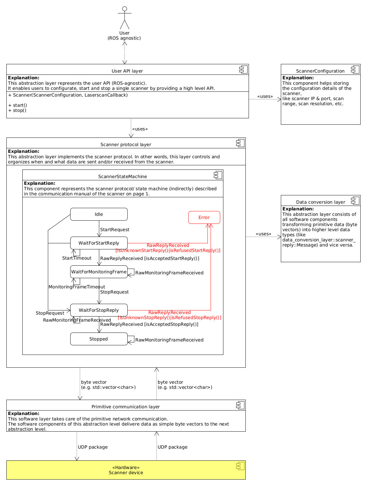

# PSENscan software architecture
The following diagram shows the overall architecture of the PSENscan software.

* The refferenced User API is mainly defined by the psen_scan_v2::ScannerV2 class.
* For the Scanner protocol Layer please check psen_scan_v2::scanner_protocol::ScannerProtocolDef.
* Data Serialization and Deserialization is for example handled in psen_scan_vs::toLaserScan
* For the  Primitive communication layer most tasks are handled in psen_scan_v2::UdpClientImpl

The following sequence diagram shows the interaction between the software components in a typical use case scenario (User calls start, receives a laserscan and calls stop).
