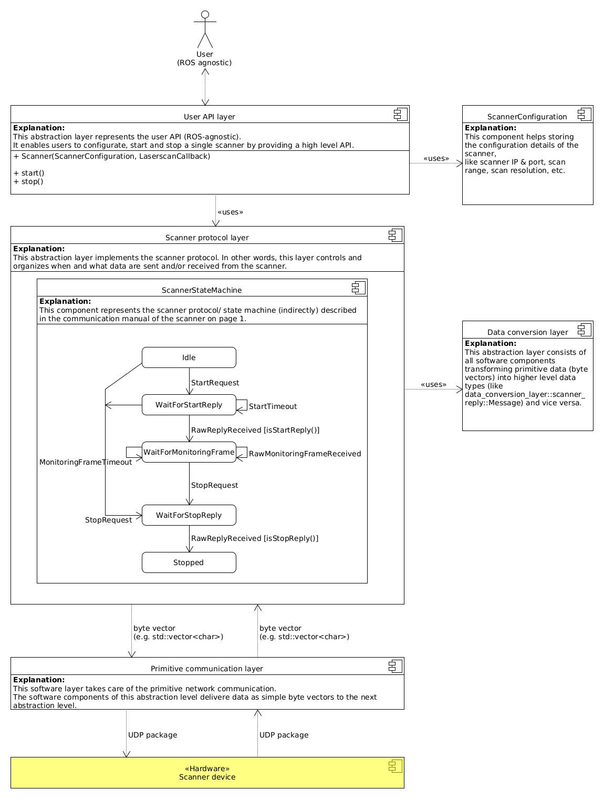
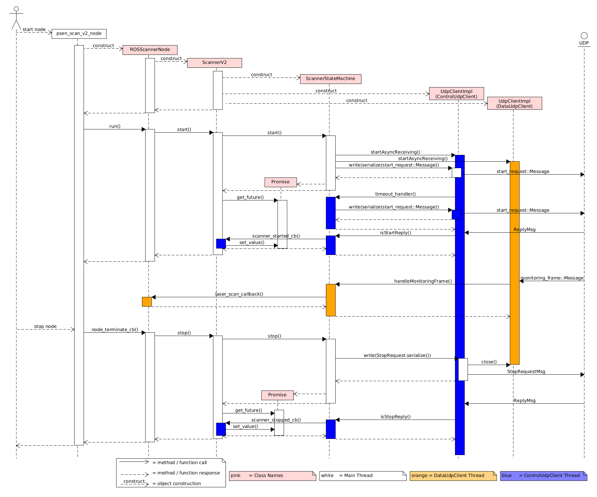

# PSENscan software architecture
The following diagram shows the overall architecture of the PSENscan software.

## Detailed Description
The overall architecture should give a good idea of how the driver is supposed to work.
For more details we recommend taking a look at the source code itself:
* For the **ROS** part we refer to `psen_scan_v2::ROSScannerNodeT`.
* The referenced **User API** is implemented by `psen_scan_v2_standalone::ScannerV2`.
* For the **Scanner protocol layer** please check `psen_scan_v2_standalone::protocol_layer::ScannerStateMachine`.
* Data **Serialization** and **Deserialization** is for example handled in `psen_scan_v2_standalone::data_conversion_layer::monitoring_frame::deserialize()` or `psen_scan_v2_standalone::data_conversion_layer::scanner_reply::serialize()`.
* For the  **Primitive communication layer** we recommend taking a look at `psen_scan_v2_standalone::communication_layer::UdpClientImpl`.

## Workflow
To help understand the workflow the following sequence diagram shows the interaction between the software components in a typical use case scenario (User calls start, receives a laserscan and calls stop).

