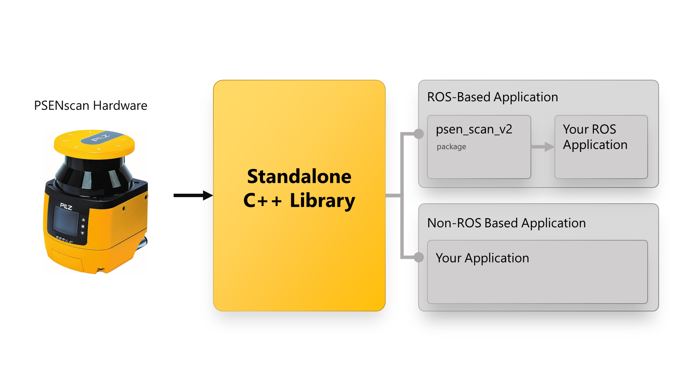

[](https://www.pilz.com)

# PILZ safety laser scanner PSENscan Standalone C++ Library

The PSENscan Standalone C++ Library allows you to easily integrate the PSENscan safety laser scanner into your application without depending on ROS. You will be able to read both distance and intensity values from the PSENscan safety laser scanner, which can subsequently be used for navigation algorithms and much more.

<p align="center">

</p>

## Build Status
[](https://github.com/PilzDE/psen_scan_v2/actions?query=event%3Apush+workflow%3ACI-Standalone+branch%3Amain)

## Table of Contents

1. [Prerequisites](#prerequisites)
2. [Get Started on Linux](#get-started-on-linux)
3. [Get Started on Windows](#get-started-on-windows)
4. [C++ API](#c++-api)

## Prerequisites
In order to build and use the PSENscan Standalone C++ Library you need Ubuntu version 18.04 or 20.04. Other operating systems are not officially supported.

Make sure you have all necessary tools and libraries installed:
```
sudo apt-get install build-essential cmake git libboost-system-dev libconsole-bridge-dev libfmt-dev
```

## Get Started on Linux

- First, clone this repository:
  ```
  git clone https://github.com/PilzDE/psen_scan_v2.git
  ```

- Next, navigate to the standalone folder and create a `build` directory.
  ```
  cd psen_scan_v2/standalone/
  mkdir build
  ```

- Lastly, execute the following:
  ```
  cd build/ && cmake .. && make
  ```

The library should now be built and available under `psen_scan_v2/standalone/build/libpsen_scan_v2_standalone.a`

### Running the tests on Linux
Same as above but as the last step run
```
cd build/ && cmake .. -DBUILD_TESTING=ON && make && ctest
```

### Usage example
An example application, which prints distance data to the screen, is built by default and can be executed in the `build` folder:
```
./psen_scan_v2_standalone_app
```

## Get Started on Windows
### Build and install dependencies
#### Visual Studio
- Get Visual Studio from https://visualstudio.microsoft.com/de/
- Building is currently tested under `Visual Studio 16 2019` on `Windows Server 2019`
- Open `Visual Studio Developer Command Prompt`
- Use this Console for the next steps

#### Boost
- First download source from https://www.boost.org/
- Building is currently tested under `1.72.0`
- Unzip the file and open the folder e.g. `boost_1_72_0` since the lib is used as header-only no install step is required.

#### console_bridge
- Download source from Github (https://github.com/ros/console_bridge)
- Open the `console_bridge`-folder, with the `CMakeLists.txt` in it
- Generate Visual Studio Project
  ```
  cmake -G "Visual Studio 16 2019" .
  ```
  _With `cmake -G` you can check which generators are abailable_

- Build the generated project with 
  ```
  cmake --build . --target ALL_BUILD
  ```
  `--target` is the available Visual Studio Project we generated before, you can look in the folder how they are named

- Install console_bridge with 
  ```
  cmake --build . --target INSTALL
  ```
  _You may need admin privileges_

#### fmt
- Download source from Github (https://github.com/fmtlib/fmt)
- Building is currently tested under `6.1.2`
- Open the `fmt`-folder, with the `CMakeLists.txt` in it
- Generate Visual Studio Project: 
   ```
   cmake -G "Visual Studio 16 2019" .
   ```
   _With `cmake -G` you can check which generators are abailable_
- Build the generated project with 
  ```
  cmake --build . --config Release --target ALL_BUILD
  ```
  `--target` is the available Visual Studio Project we generated before, you can look in the folder how they are named
- Install with 
  ```
  cmake --build . --config Release --target INSTALL
  ```
  _You may need admin privileges_

### Build psen_scan_v2_standalone
- Download source from Github
- Open the `standalone`-folder, with the `CMakeLists.txt` in it
- Create a build folder and open it 
  ```
  mkdir build64
  pushd build64
  ```
- Generate Visual Studio Project 
  Note that you will have to replace `<PATH_TO_BOOST>` according to the previous step.
  ```
  cmake -DBoost_INCLUDE_DIR="<PATH_TO_BOOST>" -DBUILD_TESTING=OFF -G "Visual Studio 16 2019" ..
  ```
- Go back to `standalone`-folder 
  ```
  popd
  ```
- Build library 
  ```
  cmake --build build64 --config Release --target ALL_BUILD
  ```

_If there is any problem, check if all paths are set correct with `cmake -DBoost_DEBUG=ON`_

### Usage example
An example application, which prints distance data to the screen, is built by default and can be executed in the `build` folder:
```
./Release/psen_scan_v2_standalone_app.exe
```

Feel free to take a look at the [example code](https://github.com/PilzDE/psen_scan_v2/blob/main/standalone/main.cpp) as well as the [C++ Api](#c++-api) to understand how to integrate the C++ Library into your application.


## C++ Api
For more Documentation please take a look at the generated Doxygen [Code API][]. The following classes are good to get started:
 - [LaserScan][]
 - [ScannerV2][]


[Code API]: http://docs.ros.org/en/noetic/api/psen_scan_v2/html/
[LaserScan]: http://docs.ros.org/en/noetic/api/psen_scan_v2/html/classpsen__scan__v2__standalone_1_1LaserScan.html
[ScannerV2]: http://docs.ros.org/en/noetic/api/psen_scan_v2/html/classpsen__scan__v2__standalone_1_1ScannerV2.html
