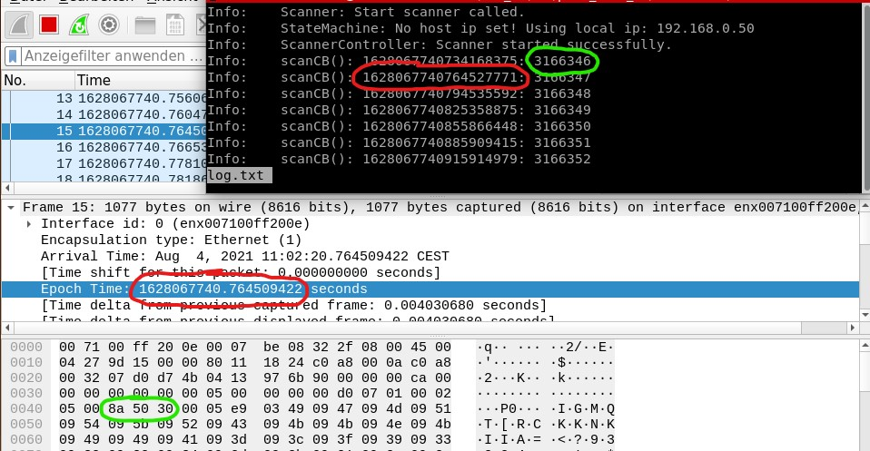

<!-- Copyright (c) 2021 Pilz GmbH & Co. KG

This program is free software: you can redistribute it and/or modify
it under the terms of the GNU Lesser General Public License as published by
the Free Software Foundation, either version 3 of the License, or
(at your option) any later version.

This program is distributed in the hope that it will be useful,
but WITHOUT ANY WARRANTY; without even the implied warranty of
MERCHANTABILITY or FITNESS FOR A PARTICULAR PURPOSE.  See the
GNU Lesser General Public License for more details.

You should have received a copy of the GNU Lesser General Public License
along with this program.  If not, see <https:#www.gnu.org/licenses/>.
-->

# Acceptancetest Timestamps
Check if the calculation of the scan-timestamps (first ray time) is correct using wireshark.

## Build
Create a `build`-folder in the `standalone` directory and build the test using the `BUILD_TESTING` flag as follows:
```
mkdir build
cd build
cmake .. -DBUILD_TESTING=ON
make
```

## Test-Execution
Open `wireshark` and record the communication at the network-interface to the scanner. Then execute the test residing in the `build`-folder:
```
./acceptancetest_print_timestamps > log.txt
```
Once the program has finished, you can compare the resulting data in the log-file with the udp-data in wireshark (scan counters & timestamps).

### Optional Parameters
Repeat the test with fragmented scans by executing:
```
./acceptancetest_print_timestamps fragmented_scans true > log.txt
```
and with a smaller scan range (given in tenth of degree), for example:
```
./acceptancetest_print_timestamps angle_start -200 angle_end 200 > log.txt
```

## Comparison example
The calculated timestamp of the laser-scan (first ray time) with scan counter `n` has to be greater than the timestamp of the last frame with scan counter `n-1` in wireshark and smaller than the timestamp of the first frame with scan counter `n` in wireshark. An example is shown in the screenshot below.


