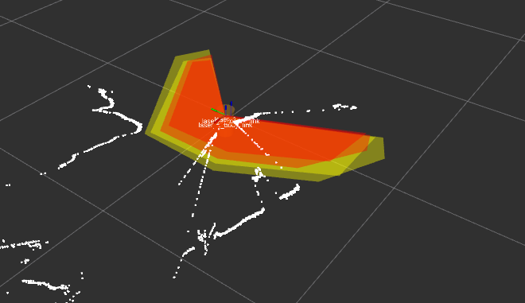
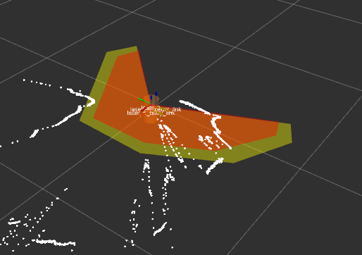

# Acceptance test to verify that multiple zones are not displayed simultaneously.  

Definition of the identified error case can be found in : [Issue #328](https://github.com/PilzDE/psen_scan_v2/issues/328)

## Setup
Make sure your scanner has a configuration with two different zone sets, for example like [this file](acceptancetest_multiple_zones_display.xml)

Then make sure, the launchfile `acceptancetest_multiple_zones_display.launch` also uses that config.

## Test procedure
When starting the test you are looking for this **error**:



If the error does **not** occur, it will look like this: 



The scanner will switch the zones every second. 
Observer for **30s**.
If the error pattern is visible in any of the switches, the test is to be considered failed.

## Start the test
```
roslaunch psen_scan_v2 acceptancetest_multiple_zones_display.launch 
```